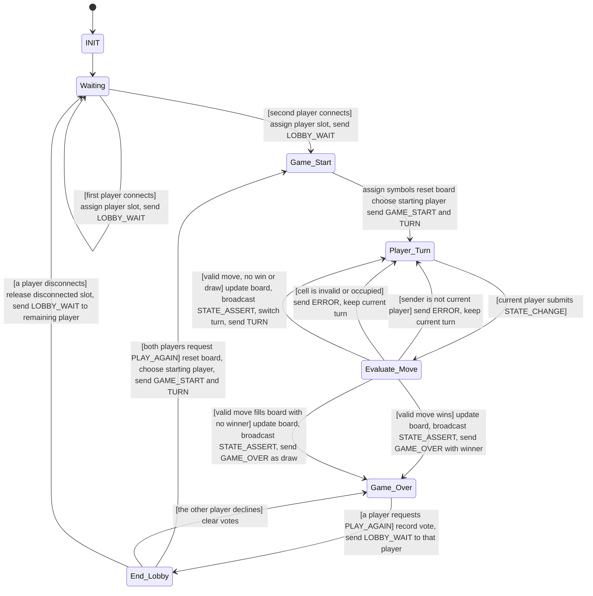

```mermaid
stateDiagram-v2
    [*] --> INIT
    INIT --> Waiting
    Waiting --> Waiting: [first player connects] assign player slot, send LOBBY_WAIT
    Waiting --> Game_Start: [second player connects] assign player slot, send LOBBY_WAIT
    Game_Start --> Player_Turn: assign symbols reset board choose starting player send GAME_START and TURN
    Player_Turn --> Evaluate_Move: [current player submits STATE_CHANGE]
    Evaluate_Move --> Player_Turn: [sender is not current player] send ERROR, keep current turn
    Evaluate_Move --> Player_Turn: [cell is invalid or occupied] send ERROR, keep current turn
    Evaluate_Move --> Player_Turn: [valid move, no win or draw] update board, broadcast STATE_ASSERT, switch turn, send TURN
    Evaluate_Move --> Game_Over: [valid move wins] update board, broadcast STATE_ASSERT, send GAME_OVER with winner
    Evaluate_Move --> Game_Over: [valid move fills board with no winner] update board, broadcast STATE_ASSERT, send GAME_OVER as draw
    Game_Over --> End_Lobby: [a player requests PLAY_AGAIN] record vote, send LOBBY_WAIT to that player
    End_Lobby --> Game_Start: [both players request PLAY_AGAIN] reset board, choose starting player, send GAME_START and TURN
    End_Lobby --> Game_Over: [the other player declines] clear votes
    End_Lobby --> Waiting: [a player disconnects] release disconnected slot, send LOBBY_WAIT to remaining player
```
