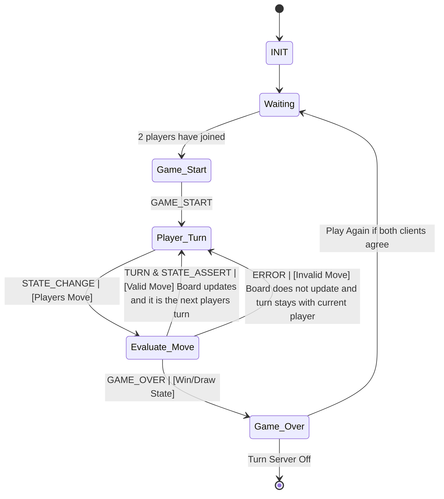

```mermaid
stateDiagram-v2
    [*] --> INIT
    INIT --> Waiting
    Waiting --> Game_Start: 2 players have joined
    Game_Start --> Player_Turn: GAME_START
    Player_Turn --> Evaluate_Move: STATE_CHANGE | [Players Move]
    Evaluate_Move --> Player_Turn: TURN & STATE_ASSERT | [Valid Move] Board updates and it is the next players turn
    Evaluate_Move --> Player_Turn: ERROR | [Invalid Move] Board does not update and turn stays with current player
    Evaluate_Move --> Game_Over: GAME_OVER | [Win/Draw State]
    Game_Over --> [*]: Turn Server Off
    Game_Over --> Waiting: Play Again if both clients agree
```
