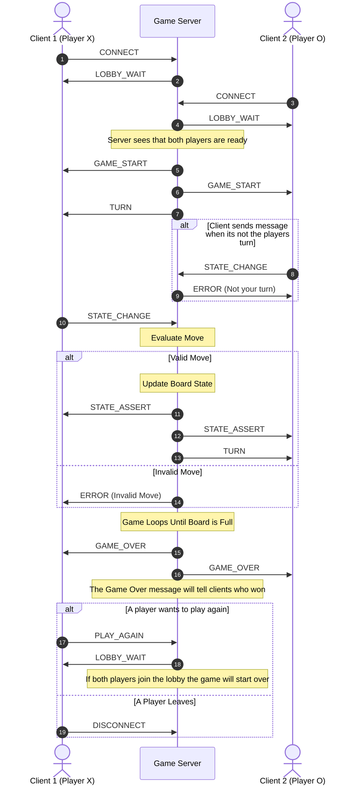

```mermaid
sequenceDiagram
    autonumber
    actor Client1 as Client 1 (Player X)
    participant Server as Game Server
    actor Client2 as Client 2 (Player O)


    Client1->>Server: CONNECT
    Server->>Client1: LOBBY_WAIT
    Client2->>Server: CONNECT
    Server->>Client2: LOBBY_WAIT
    Note over Server: Server sees that both players are ready
    Server->>Client1: GAME_START
    Server->>Client2: GAME_START
    Server->>Client1: TURN
    alt Client sends message when its not the players turn
        Client2->>Server: STATE_CHANGE
        Server->>Client2: ERROR (Not your turn)
    end
    Client1->>Server: STATE_CHANGE
    Note over Server: Evaluate Move
    alt Valid Move
        Note over Server: Update Board State
        Server->>Client1: STATE_ASSERT
        Server->>Client2: STATE_ASSERT
        Server->>Client2: TURN
    else Invalid Move
        Server->>Client1: ERROR (Invalid Move)
    end
    Note over Server: Game Loops Until Board is Full
    Server->>Client1: GAME_OVER
    Server->>Client2: GAME_OVER
    Note over Server: The Game Over message will tell clients who won
    alt A player wants to play again
        Client1->>Server: PLAY_AGAIN
        Server->>Client1: LOBBY_WAIT
        #Server->>Client2: LOBBY_WAIT
        Note over Server: If both players join the lobby the game will start over
    else A Player Leaves
        Client1->>Server: DISCONNECT
    end
```