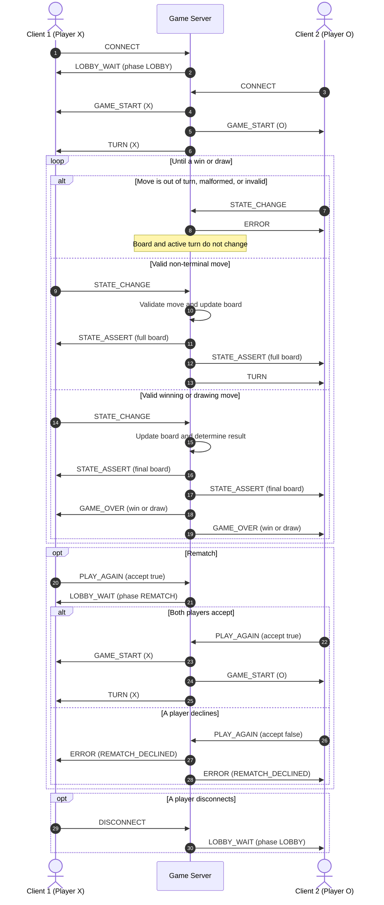

```mermaid
sequenceDiagram
    autonumber
    actor Client1 as Client 1 (Player X)
    participant Server as Game Server
    actor Client2 as Client 2 (Player O)


    Client1->>Server: CONNECT
    Server->>Client1: LOBBY_WAIT (phase LOBBY)
    Client2->>Server: CONNECT
    Server->>Client1: GAME_START (X)
    Server->>Client2: GAME_START (O)
    Server->>Client1: TURN (X)

    loop Until a win or draw
        alt Move is out of turn, malformed, or invalid
            Client2->>Server: STATE_CHANGE
            Server->>Client2: ERROR
            Note over Server: Board and active turn do not change
        else Valid non-terminal move
            Client1->>Server: STATE_CHANGE
            Server->>Server: Validate move and update board
            Server->>Client1: STATE_ASSERT (full board)
            Server->>Client2: STATE_ASSERT (full board)
            Server->>Client2: TURN
        else Valid winning or drawing move
            Client1->>Server: STATE_CHANGE
            Server->>Server: Update board and determine result
            Server->>Client1: STATE_ASSERT (final board)
            Server->>Client2: STATE_ASSERT (final board)
            Server->>Client1: GAME_OVER (win or draw)
            Server->>Client2: GAME_OVER (win or draw)
        end
    end

    opt Rematch
        Client1->>Server: PLAY_AGAIN (accept true)
        Server->>Client1: LOBBY_WAIT (phase REMATCH)
        alt Both players accept
            Client2->>Server: PLAY_AGAIN (accept true)
            Server->>Client1: GAME_START (X)
            Server->>Client2: GAME_START (O)
            Server->>Client1: TURN (X)
        else A player declines
            Client2->>Server: PLAY_AGAIN (accept false)
            Server->>Client1: ERROR (REMATCH_DECLINED)
            Server->>Client2: ERROR (REMATCH_DECLINED)
        end
    end

    opt A player disconnects
        Client1->>Server: DISCONNECT
        Server->>Client2: LOBBY_WAIT (phase LOBBY)
    end
```